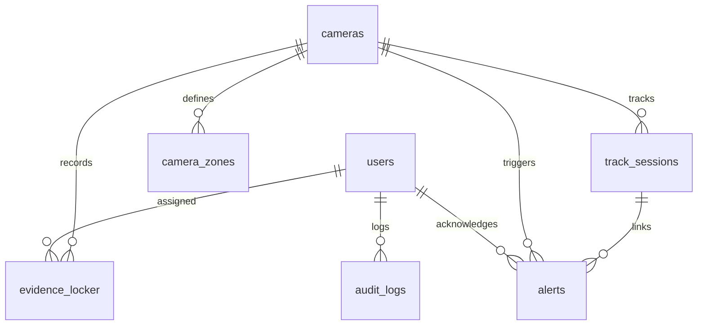

# Comprehensive Implementation Plan: IBVAP Backend (Pure SQLite Architecture)

A robust, modular, and decoupled backend for the **Intelligent Border Video Analytics Platform (IBVAP)** for **SIH 2026**. 

This plan reflects the architectural directive: **SQLite (`data/ibvap.db`) is our single, dedicated database** for development, testing, and live SIH demonstrations. The AI engine in `OutLiners_SIH/` remains **100% untouched and immutable**, wrapped cleanly through a high-performance adapter layer.

---

## User Review Required

> [!IMPORTANT]
> **Single Database Directive (100% SQLite)**: 
> `data/ibvap.db` is the sole database engine. No PostgreSQL setup or dual-database complexity. The SQLite engine is tuned with:
> * `PRAGMA journal_mode=WAL;` (Write-Ahead Logging: enables concurrent non-blocking reads while the AI worker writes alerts).
> * `PRAGMA synchronous=NORMAL;` (Optimized I/O throughput for real-time edge hardware).
> * `PRAGMA foreign_keys=ON;` (Relational integrity enforcement).

> [!IMPORTANT]
> **Zero Code Modifications to `OutLiners_SIH`**:
> The folder `OutLiners_SIH` will not be altered, moved, or duplicated. The backend dynamically imports its engines (`PerimeterTrackerEngine`, `FaceRecognitionEngine`, `VehicleEngine`, `SpatialIntrusionEngine`) via Python path injection inside `backend/app/services/ai_adapter.py`.

---

## Backend Directory Tree

The entire backend will reside in a dedicated `backend/` directory at the project root:

```text
d:\sih 2026 ibvap\
├── OutLiners_SIH/                      # [EXISTING AI ENGINE - UNTOUCHED]
│   ├── tracker_engine.py              # PerimeterTrackerEngine
│   ├── face_engine.py                 # FaceRecognitionEngine (MTCNN + ResNet512)
│   ├── vehicle_engine.py              # VehicleEngine (EasyOCR + CLAHE)
│   ├── intrusion_engine.py            # SpatialIntrusionEngine (Tripwire & Geofence)
│   ├── enhancement.py                 # CLAHE contrast enhancement
│   ├── models/                        # Neural network weights (*.pt, *.zip)
│   └── data/                          # Media outputs & legacy JSON fallbacks
│
└── backend/                           # [NEW: 100% PURE SQLITE BACKEND]
    ├── run.py                         # Application entry point (Uvicorn launcher)
    ├── requirements.txt               # Backend Python dependencies
    ├── .env                           # Environment configuration
    ├── .env.example                   # Configuration template
    │
    ├── data/                          # Backend runtime data (created automatically)
    │   └── ibvap.db                   # Single embedded SQLite database (WAL mode)
    │
    ├── app/                           # Main Application Package
    │   ├── __init__.py
    │   ├── main.py                    # FastAPI app factory, CORS, static mounts, startup hooks
    │   │
    │   ├── core/                      # Global Configuration & Utilities
    │   │   ├── __init__.py
    │   │   ├── config.py              # Pydantic Settings (.env loader & path resolution)
    │   │   ├── security.py            # Password hashing (bcrypt) & JWT token handlers
    │   │   ├── hashing.py             # Cryptographic SHA-256 file integrity verifier
    │   │   └── constants.py           # Severity enums, alert types, threat thresholds
    │   │
    │   ├── db/                        # Pure SQLite Database Layer
    │   │   ├── __init__.py
    │   │   ├── session.py             # SQLite engine setup, WAL PRAGMAs, SessionLocal
    │   │   ├── base.py                # SQLAlchemy DeclarativeBase
    │   │   └── init_db.py             # Database creation & seed data (admin, preset cameras)
    │   │
    │   ├── models/                    # SQLAlchemy ORM Models (Pure SQLite Schema)
    │   │   ├── __init__.py
    │   │   ├── user.py                # Sentry operator accounts, roles, badges
    │   │   ├── camera.py              # CCTV cameras, RTSP streams, status, resolution
    │   │   ├── zone.py                # Geofence polygons & virtual tripwires
    │   │   ├── alert.py               # Real-time perimeter alerts & acknowledgment
    │   │   ├── evidence.py            # Forensic cases, crop/scene paths, SHA-256
    │   │   ├── whitelist.py           # Registered personnel (FRS) & vehicles (ANPR)
    │   │   ├── track_session.py       # Object tracking sessions & trajectory points
    │   │   └── audit_log.py           # Chain of custody military audit logs
    │   │
    │   ├── schemas/                   # Pydantic DTOs (Request / Response validation)
    │   │   ├── __init__.py
    │   │   ├── auth.py                # Login request, JWT token response
    │   │   ├── camera.py              # CameraCreate, CameraResponse, StreamConnect
    │   │   ├── zone.py                # ZoneUpdate (geofence & tripwire coordinates)
    │   │   ├── alert.py               # AlertResponse, AlertAckRequest
    │   │   ├── evidence.py            # EvidenceResponse, EvidenceVerifyResult
    │   │   ├── whitelist.py           # FaceEnrollRequest, VehicleRegisterRequest
    │   │   └── telemetry.py           # Live telemetry data structure
    │   │
    │   ├── services/                  # Business Logic & Decoupled Workers
    │   │   ├── __init__.py
    │   │   ├── ai_adapter.py          # [CRITICAL] Wraps OutLiners_SIH without code changes
    │   │   ├── camera_manager.py      # Camera ingestion threads & auto-reconnect logic
    │   │   ├── stream_broadcaster.py  # Circular ring buffer (serves multi-client MJPEG)
    │   │   ├── alert_dispatcher.py    # Persists alerts into SQLite & pushes to WebSockets
    │   │   └── whitelist_sync.py      # Syncs SQLite personnel/vehicles with AI engine JSONs
    │   │
    │   └── api/                       # API Routes & WebSocket Endpoints
    │       ├── __init__.py
    │       ├── deps.py                # FastAPI dependency injection (get_db, get_current_user)
    │       ├── v1/                    # Versioned REST Controllers
    │       │   ├── __init__.py
    │       │   ├── auth.py            # Operator authentication (login, me)
    │       │   ├── cameras.py         # Camera CRUD, stream start/stop
    │       │   ├── zones.py           # Dynamic geofence & tripwire calibration
    │       │   ├── streams.py         # Low-latency MJPEG live feed & snapshots
    │       │   ├── alerts.py          # Query alerts, filter by severity, acknowledge
    │       │   ├── evidence.py        # Forensic cases, SHA-256 verification
    │       │   ├── whitelist.py       # Face & vehicle plate registration
    │       │   └── analytics.py       # 24h intrusion trends, threat summary
    │       └── websockets/
    │           ├── __init__.py
    │           ├── alerts_ws.py       # Instant alert broadcasts to trigger UI sirens
    │           └── telemetry_ws.py    # Real-time FPS, track count, threat meter
    │
    └── tests/                         # Automated Backend Verification
        ├── __init__.py
        ├── test_db.py                 # Tests SQLite table creation and WAL mode
        ├── test_ai_adapter.py         # Tests OutLiners_SIH inference without errors
        └── test_api.py                # Tests REST endpoints and WebSocket handshakes
```

---

## Phased Implementation Roadmap

### Phase 1: Environment & Pure SQLite Data Layer
* **Goal**: Establish the running environment and initialize `data/ibvap.db`.
* **Actions**:
  1. Create `backend/requirements.txt` and `.env`.
  2. Implement `backend/app/db/session.py` configured strictly for SQLite with automatic `PRAGMA journal_mode=WAL;` and `PRAGMA foreign_keys=ON;`.
  3. Define all SQLAlchemy models (`models/user.py`, `camera.py`, `zone.py`, `alert.py`, `evidence.py`, `whitelist.py`, `track_session.py`, `audit_log.py`).
  4. Write `backend/app/db/init_db.py` to auto-generate all tables and seed default cameras (`CAM-01`, `CAM-04`, `CAM-USB`) and default sentry operator (`admin` / `admin123`).

### Phase 2: AI Adapter Bridge (Decoupled Integration)
* **Goal**: Enable the backend to control and query `OutLiners_SIH` without modifying a single line of AI code.
* **Actions**:
  1. Implement `backend/app/services/ai_adapter.py`:
     - Dynamically add `OutLiners_SIH` to `sys.path`.
     - Instantiate `FaceRecognitionEngine`, `VehicleEngine`, and `PerimeterTrackerEngine`.
     - Expose `process_frame(frame)`, `update_zones()`, and an alert hook callback.
  2. Implement `backend/app/services/whitelist_sync.py`:
     - Keep SQLite `registered_personnel` and `registered_vehicles` synced with the JSON files read by `face_engine.py` and `vehicle_engine.py`.
  3. Validate using a standalone test script `test_ai_adapter.py`.

### Phase 3: Camera Ingestion, Worker Threads & Live Streaming
* **Goal**: Stream processed CCTV video to web clients at 25+ FPS without running duplicate AI models.
* **Actions**:
  1. Implement `backend/app/services/stream_broadcaster.py`:
     - Thread-safe circular buffer (ring buffer) storing the latest annotated JPEG frame.
  2. Implement `backend/app/services/camera_manager.py`:
     - Background daemon thread per active camera.
     - Ingests video from RTSP, webcam, or sample `.mp4` file.
     - Runs `ai_adapter.process_frame()` in real time.
     - Updates `stream_broadcaster` and handles automatic reconnect with exponential backoff on dropped RTSP feeds.
  3. Implement `backend/app/api/v1/streams.py`:
     - `GET /api/v1/streams/{camera_id}/feed`: Multipart MJPEG stream (`multipart/x-mixed-replace`).
     - `GET /api/v1/streams/{camera_id}/snapshot`: Single JPEG frame.

### Phase 4: Real-Time Alerts & WebSocket Hub
* **Goal**: Sub-5ms alert delivery from AI detections to sentry UI for immediate audible siren and incident modal.
* **Actions**:
  1. Implement `backend/app/services/alert_dispatcher.py`:
     - Receives alerts from `ai_adapter` callback.
     - Persists alerts and evidence records into `data/ibvap.db`.
     - Dispatches formatted alert JSON packets to the WebSocket connection manager.
  2. Implement `backend/app/api/websockets/alerts_ws.py`:
     - `ws://localhost:8000/ws/alerts`: Broadcasts real-time events (`ALERT_TRIGGERED`).
  3. Implement `backend/app/api/websockets/telemetry_ws.py`:
     - `ws://localhost:8000/ws/telemetry`: Broadcasts FPS, threat meter (0-100%), and track counts every 1s.

### Phase 5: REST API Controllers
* **Goal**: Complete API surface for all dashboard operations.
* **Actions**:
  1. `cameras.py`: List cameras, add camera, connect/disconnect stream.
  2. `zones.py`: Dynamic calibration of polygon geofences & tripwires submitted from HTML5 canvas.
  3. `alerts.py`: Paginated alert queries, filtering by severity (`CRITICAL`, `WARNING`), and acknowledgment workflow (`acknowledged_by`, `resolution_notes`).
  4. `evidence.py`: Forensic evidence locker browser, single-case inspection, status lifecycle (`NEW` -> `INVESTIGATING` -> `RESOLVED`), and **SHA-256 tamper verification endpoint** (`POST /api/v1/evidence/{id}/verify`).
  5. `whitelist.py`: Register personnel (photo + name + badge) and official convoy vehicle plates.
  6. `analytics.py`: Summary statistics (total breaches, top intrusion zones, hourly threat graph).

### Phase 6: System Assembly & Static Media Mounting
* **Goal**: Connect all pieces into `main.py` and verify end-to-end operation.
* **Actions**:
  1. Configure `backend/app/main.py`:
     - Mount `data/` at `/data` via `StaticFiles` so the frontend can display evidence crops (`/data/evidence/...`) and uploads.
     - Attach CORS middleware allowing frontend origin (`http://localhost:5173`).
     - Register API routers and WebSocket endpoints.
  2. Implement `backend/run.py` server launcher.

---

## Detailed Pure SQLite Schema (`data/ibvap.db`)

The SQLite database will contain the following relational tables:



| Table Name | Primary Key | Key Columns | Purpose |
| :--- | :--- | :--- | :--- |
| `users` | `id` (TEXT) | `username`, `password_hash`, `full_name`, `role`, `badge_number` | Operator & commander authentication. |
| `cameras` | `id` (TEXT) | `name`, `sector_zone`, `source_type`, `stream_url`, `status`, `fps`, `resolution` | Local CCTV camera sources & status. |
| `camera_zones` | `id` (TEXT) | `camera_id`, `name`, `zone_type`, `coordinates` (JSON), `sensitivity` | Geofence polygons and tripwires. |
| `registered_personnel` | `id` (TEXT) | `full_name`, `designation`, `badge_number`, `face_embedding` (JSON 512 floats), `photo_path` | Biometric FRS whitelist. |
| `registered_vehicles` | `id` (TEXT) | `license_plate` (UNIQUE), `vehicle_type`, `owner_name`, `is_whitelisted` | ANPR checkpoint whitelist. |
| `track_sessions` | `id` (INTEGER AUTO) | `camera_id`, `track_number`, `class_name`, `max_threat_score`, `dominant_behavior`, `trajectory_points` (JSON) | ByteTrack sessions and trajectories. |
| `alerts` | `id` (TEXT) | `camera_id`, `alert_type`, `severity`, `threat_score`, `behavior`, `snapshot_url`, `is_acknowledged` | Real-time intrusion and threat alerts. |
| `evidence_locker` | `id` (TEXT) | `camera_id`, `crop_image`, `scene_image`, `sha256_hash`, `status`, `threat_score` | Forensic tamper-evident cases. |
| `audit_logs` | `id` (INTEGER AUTO) | `user_id`, `action`, `entity_type`, `entity_id`, `ip_address`, `created_at` | Non-repudiation sentry audit trail. |

---

## Verification & Testing Plan

### Automated Tests
1. **Database Test (`backend/tests/test_db.py`)**:
   - Verify `data/ibvap.db` is created.
   - Verify all 9 tables exist.
   - Verify `PRAGMA journal_mode` equals `'wal'`.
2. **AI Adapter Test (`backend/tests/test_ai_adapter.py`)**:
   - Verify `AIEngineAdapter` loads without modifying `OutLiners_SIH`.
   - Pass a blank test frame through `process_frame()` and confirm valid output.
3. **API Smoke Test (`backend/tests/test_api.py`)**:
   - Verify `GET /api/v1/cameras` returns seeded cameras.
   - Verify `GET /docs` (Swagger UI) loads cleanly.

### Manual / Live Sentry Verification
1. **Live Feed Test**:
   - Launch `python backend/run.py`.
   - Open `http://127.0.0.1:8000/api/v1/streams/CAM-04/feed` in a browser.
   - Confirm video plays smoothly with AI bounding boxes, geofence overlay, and threat telemetry HUD.
2. **Real-time Alert Test**:
   - Connect to `ws://127.0.0.1:8000/ws/alerts` using a WebSocket client.
   - Verify incoming JSON alerts when subjects enter the geofence.
3. **Cryptographic SHA-256 Check**:
   - Trigger `POST /api/v1/evidence/{id}/verify`.
   - Confirm backend re-reads the image file on disk, re-hashes it, and returns `{"verified": true}`.
